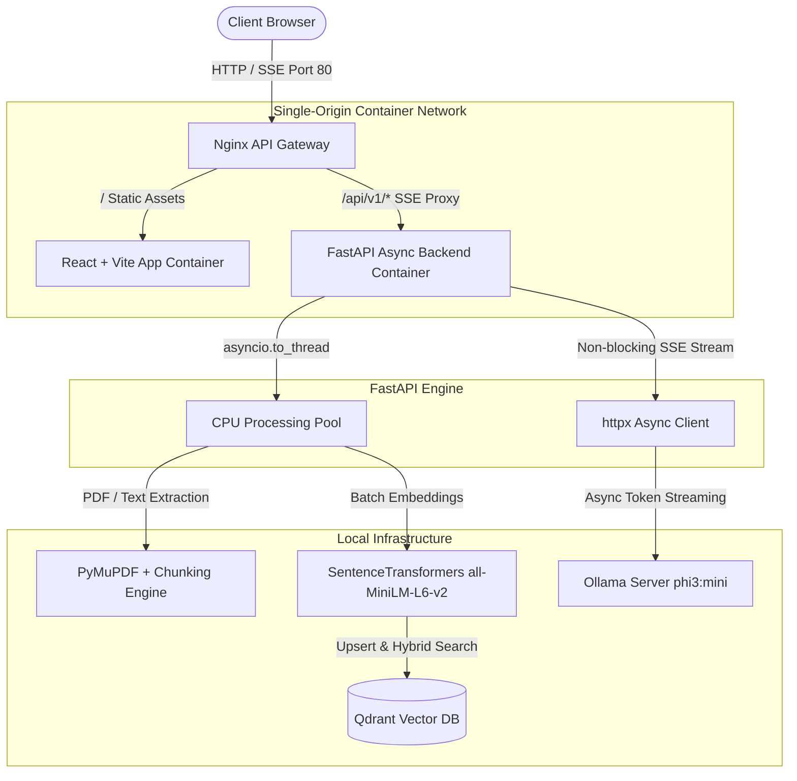
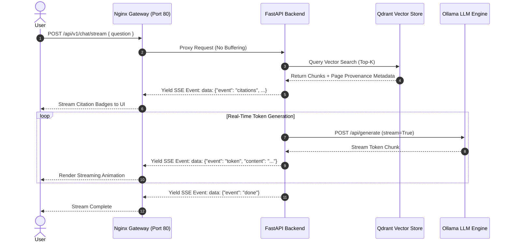

# VectorMind: Enterprise Multimodal RAG Pipeline (v2.0)

[](https://www.python.org/)
[](https://fastapi.tiangolo.com/)
[](https://reactjs.org/)
[](https://www.docker.com/)
[](https://opensource.org/licenses/MIT)

> A production-grade, 100% local Retrieval-Augmented Generation (RAG) system featuring **Server-Sent Events (SSE) Token Streaming**, **Non-blocking Async I/O**, **Source Provenance Grounding**, and an **Nginx API Gateway Container Network**.

---

## 🏛️ System Architecture

VectorMind is designed following enterprise system design patterns to decouple compute-heavy vector processing, provide sub-300ms Time-To-First-Token (TTFT) via token streaming, and maintain strict environment isolation.



---

## ⚡ Key System Design & Technical Highlights

> [!NOTE]
> **Production-Grade Design Choices**:
> - **Non-blocking Async Event Loop**: All outbound LLM requests use `httpx.AsyncClient`. CPU-bound document loading and vector embedding execution are delegated to background process pools (`asyncio.to_thread`), preventing thread exhaustion under high concurrency.
> - **Server-Sent Events (SSE) Token Streaming**: `/api/v1/chat/stream` streams response tokens chunk by chunk, drastically reducing Time-To-First-Token (TTFT) compared to blocking REST JSON responses.
> - **Source Provenance & Citation Inspector**: Every retrieved chunk preserves document name, page number, chunk index, and similarity score. The React UI features an interactive slide-over drawer to audit AI responses against exact document excerpts.
> - **Nginx Gateway & Single-Origin Topology**: Serves both static frontend assets and API requests through Nginx reverse proxying on Port 80, eliminating hardcoded `localhost:8000` URLs and CORS complexity.

---

## 🔄 End-to-End RAG Sequence Flow



---

## 🚀 Quick Start (Containerized with Docker)

### Prerequisites
- [Docker](https://www.docker.com/) & [Docker Compose](https://docs.docker.com/compose/)
- Ollama running locally (or via container) with `phi3:mini` model pulled (`ollama pull phi3:mini`)

### 1. Launch Complete Container Stack
Run a single command to build and launch all services (**Nginx Gateway**, **React Frontend**, **FastAPI Backend**, **Qdrant Vector DB**, and **Ollama**):

```bash
git clone https://github.com/singh-rounak/Enterprise-Multimodal-RAG-Pipeline-production_grade.git
cd Enterprise-Multimodal-RAG-Pipeline-production_grade

docker compose up --build -d
```

### 2. Access the Application
Once the containers start, open your browser:

* **Web Application (Workspace UI)**: [http://localhost](http://localhost)
* **OpenAPI Interactive Documentation**: [http://localhost/docs](http://localhost/docs)
* **Qdrant Dashboard / Engine**: [http://localhost:6333](http://localhost:6333)

---

## 🛠️ API Reference

| Method | Endpoint | Description | Payload / Response |
| :--- | :--- | :--- | :--- |
| `GET` | `/api/v1/health` | System health & connectivity status | `HealthResponse` |
| `POST` | `/api/v1/upload` | Upload & index PDF, TXT, or MD documents | `UploadResponse` |
| `GET` | `/api/v1/documents` | List indexed documents & chunk metrics | `DocumentListResponse` |
| `DELETE` | `/api/v1/documents/{filename}` | Purge document and associated vectors | Status Message |
| `POST` | `/api/v1/chat` | Non-streaming RAG query | `ChatResponse` (with `citations`) |
| `POST` | `/api/v1/chat/stream` | **Real-time SSE token stream** | `text/event-stream` |

### Example SSE Token Streaming Usage
```bash
curl -N -X POST http://localhost/api/v1/chat/stream \
  -H "Content-Type: application/json" \
  -d '{"question": "What are the core security requirements outlined in the uploaded document?"}'
```

**Output**:
```text
data: {"event": "citations", "citations": [{"source_file": "SecuritySpec.pdf", "page": 4, "score": 0.8921, ...}]}

data: {"event": "token", "content": "The "}
data: {"event": "token", "content": "uploaded "}
data: {"event": "token", "content": "document "}
data: {"event": "token", "content": "specifies..."}

data: {"event": "done"}
```

---

## 📦 Tech Stack & Layering

| Layer | Component | Technology Selection |
| :--- | :--- | :--- |
| **API Gateway** | Reverse Proxy | Nginx Alpine |
| **Web UI** | Frontend Workspace | React 18, TypeScript, Vite, Tailwind CSS, Lucide Icons |
| **Backend Engine** | Web Framework | FastAPI, Uvicorn, Pydantic v2 |
| **Async Engine** | HTTP Client | `httpx` (Async I/O), `asyncio.to_thread` |
| **Vector DB** | Knowledge Store | Qdrant (Cosine Distance, HNSW Payload Indexing) |
| **Embeddings** | Vector Model | `sentence-transformers/all-MiniLM-L6-v2` |
| **LLM Inference** | Text Generation | Ollama (`phi3:mini`) |
| **Document Processing** | Parsing & Chunking | PyMuPDF (`fitz`), LangChain `RecursiveCharacterTextSplitter` |

---

## 📂 Repository Structure

```
├── app/
│   ├── api/             # FastAPI routers (chat, upload, health)
│   ├── core/            # Config (Pydantic BaseSettings), exceptions, logging
│   ├── schemas/         # Pydantic data schemas (ChatRequest, Citation, UploadResponse)
│   └── services/        # Async business logic (RAGService, VectorStore, IngestionService)
├── frontend/
│   ├── src/
│   │   ├── components/  # ChatInterface, DocumentUploader, CitationInspector, DocumentList
│   │   ├── api.ts       # SSE stream decoder & API clients
│   │   └── App.tsx      # Split-pane RAG workspace application
│   ├── Dockerfile       # Multi-stage production build for React
│   └── vite.config.ts   # Vite configuration
├── nginx.conf           # Reverse proxy configuration for unified port 80 gateway
├── docker-compose.yml   # Multi-container orchestration (gateway, frontend, backend, qdrant, ollama)
├── Dockerfile           # Backend container build definition
└── requirements.txt     # Python dependencies
```

---

## 📜 License

Distributed under the [MIT License](LICENSE).